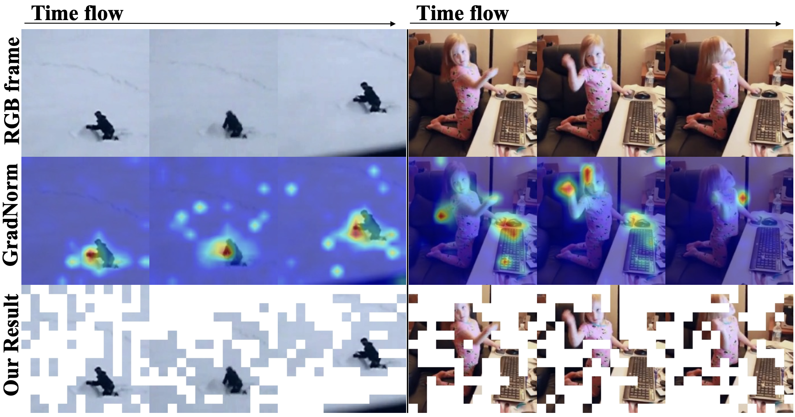

# Motion-aware Contrastive Video Representation Learning via Foreground-background Merging
Official pytorch implementation of our ICCV 2023 paper [Prune Spatio-temporal Tokens by Semantic-aware Temporal Accumulation.](https://arxiv.org/abs/2308.04549)

## Overview
To optimize the speed-accuracy trade-off, we propose **S**emantic-aware **T**emporal **A**ccumulation score (STA) to prune spatio-temporal tokens integrally. STA score considers two critical factors: temporal redundancy and semantic importance. The former depicts a specific region based on whether it is a new occurrence or a seen entity by aggregating token-to-token similarity in consecutive frames while the latter evaluates each token based on its contribution to the overall prediction. As a result, tokens with higher scores of STA carry more temporal redundancy as well as lower semantics thus being pruned. Based on the STA score, we are able to progressively prune the tokens without introducing any additional parameters or requiring further re-training.


[[Project Page]](coming soon) [[arXiv]](https://arxiv.org/abs/2308.04549) [[PDF]](https://openaccess.thecvf.com/content/ICCV2023/papers/Ding_Prune_Spatio-temporal_Tokens_by_Semantic-aware_Temporal_Accumulation_ICCV_2023_paper.pdf)

## Usage

### Requirements
- pytroch == 2.0.1
- timm == 0.4.12
- tensorboardX == 2.6.2.2 

### Data preparation
- Download the Kinetics400 dataset from the [opendatalab website](https://opendatalab.com/OpenMMLab/Kinetics-400).
- Download the Something-something V2 dataset from the [official website](https://opendatalab.com/OpenDataLab/sthv2).


### Pretrained Model
For pretrained ViT, please refer to VideoMAE model zoo. [link](https://github.com/MCG-NJU/VideoMAE/blob/main/MODEL_ZOO.md)

### Downstream Evaluation for Action Recognition
To perform downstream evaluation for action recognition, run the following bash script:
```python
    set -x
    export MASTER_PORT=$((12000 + $RANDOM % 20000))
    export OMP_NUM_THREADS=1 

    python3 -u run_inference.py \
    --model vit_large_patch16_224 \
    --data_path ${DATA_PATH} \
    --ckpt_path ${CKPT_PATH} \
    --log_dir ${OUTPUT_DIR} \
    --output_dir ${OUTPUT_DIR} \
    --batch_size 32 \
    --dist_eval \
    --r 64
```
Here, `r` represents the prune number of the first stage, and the `--model` argument corresponds to the model you choose to load as specified in the `model_vit.py` file.
Make sure to replace `${DATA_PATH}`, `${CKPT_PATH}`, and `${OUTPUT_DIR}` with the actual paths you are using for your dataset, model checkpoint, and output log directory, respectively.
To run the flops and throughput calculation code provided at the end of model_vit.py, you can simply execute the following command in your terminal:
```python
    python3 model_vit.py
```
## Visualization
We visualize GradNorm distribution for ViT-Large on the Kinetics-400 validation set. The heatmap reveals sparse patterns across the board, indicating that most tokens do not contribute significantly to the final prediction. STA retains almost all areas of high-activation GradNorm.


We visualize the proposed STA strategy. We masked out the discarded tokens with white boxes. STA not only retains informative tokens but also ensures diverse regions for improved video reasoning.


## Acknowledgement
Our code is based on the implementation of [VideoMAE](https://github.com/MCG-NJU/VideoMAE). We sincerely thanks those authors for their great works.


## Citation
If our code is helpful to your work, please consider citing:
```
@inproceedings{ding2023prune,
  title={Prune spatio-temporal tokens by semantic-aware temporal accumulation},
  author={Ding, Shuangrui and Zhao, Peisen and Zhang, Xiaopeng and Qian, Rui and Xiong, Hongkai and Tian, Qi},
  booktitle={Proceedings of the IEEE/CVF International Conference on Computer Vision},
  pages={16945--16956},
  year={2023}
}
```


